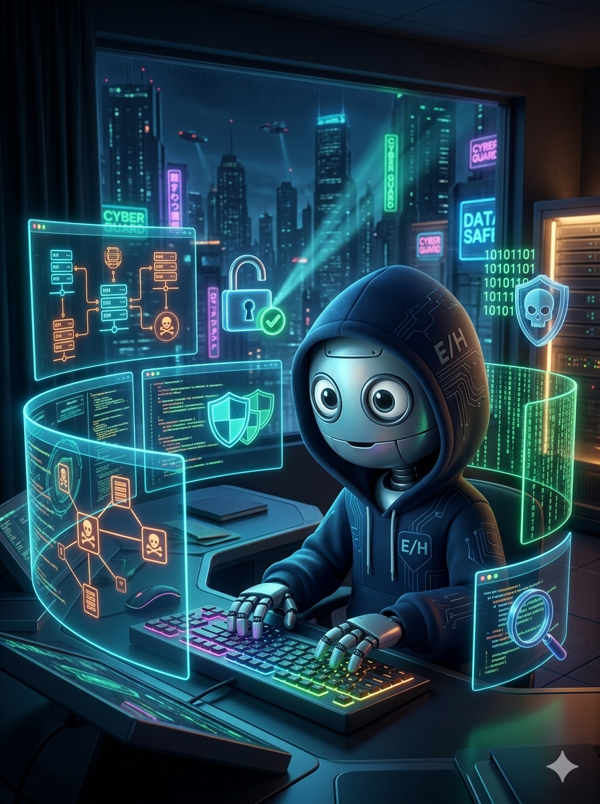

# Prefacio



## Bienvenido al Curso de Ethical Hacking 2026

Este libro representa años de experiencia práctica en ciberseguridad, pentesting y enseñanza. He's diseñado para ser tu guía completa en el mundo del hacking ético, desde los fundamentos hasta las técnicas más avanzadas.

## Cómo Usar Este Libro

### Estructura de Aprendizaje

El curso está organizado en **9 unidades progresivas**, donde cada una construye sobre los conocimientos de la anterior:

```
Unidad 1 → Fundamentos y Reconocimiento
Unidad 2 → Seguridad en IA
Unidad 3 → Explotación Web
Unidad 4 → Active Directory
Unidad 5 → Pentesting Autónomo
Unidad 6 → Evasión de Defensas
Unidad 7 → Ciberseguridad Industrial
Unidad 8 → Post-Explotación y Ética
Unidad 9 → Herramientas Web
```

### Convenciones del Libro

| Símbolo | Significado |
|---------|-------------|
| 🔴 | Severidad Crítica |
| 🟠 | Severidad Alta |
| 🟡 | Severidad Media |
| ⚔️ | Ejercicio de Explotación |
| 🛡️ | Técnica de Defensa |
| 💻 | Comandos/Tools |

### Labs Prácticos

Cada unidad incluye laboratorios prácticos donde aplicarás los conceptos aprendidos. **IMPORTANTE**: Estos labs están diseñados para realizarse en entornos controlados, nunca en sistemas reales sin autorización.

## Requisitos del Curso

### Software Necesario

- **Kali Linux 2024.x** (VM recomendada: VirtualBox/VMware)
- **Docker Desktop** para contenedores de práctica
- **8GB RAM mínimo** (16GB recomendado)
- **100GB espacio en disco**

### Conocimientos Previos

- Fundamentos de redes (TCP/IP, protocolos)
- Sistemas operativos (Windows/Linux)
- Programación básica (Python recomendado)

## Certificaciones Alineadas

Este curso está alineado con:

- ✅ CEH (Certified Ethical Hacker) - EC-Council
- ✅ OSCP (Offensive Security Certified Professional)
- ✅ CompTIA Security+

---

## Agradecimientos

A mi familia por su paciencia infinita durante las largas noches de investigación y escritura.

A mis estudiantes de ABACOM, ESPE, UIDE y del Máster UCM por enseñarme siempre algo nuevo.

A la comunidad de ciberseguridad latinamericana por compartir conocimientos libremente.

**Diego Saavedra**  
@statick88  
Marzo 2026